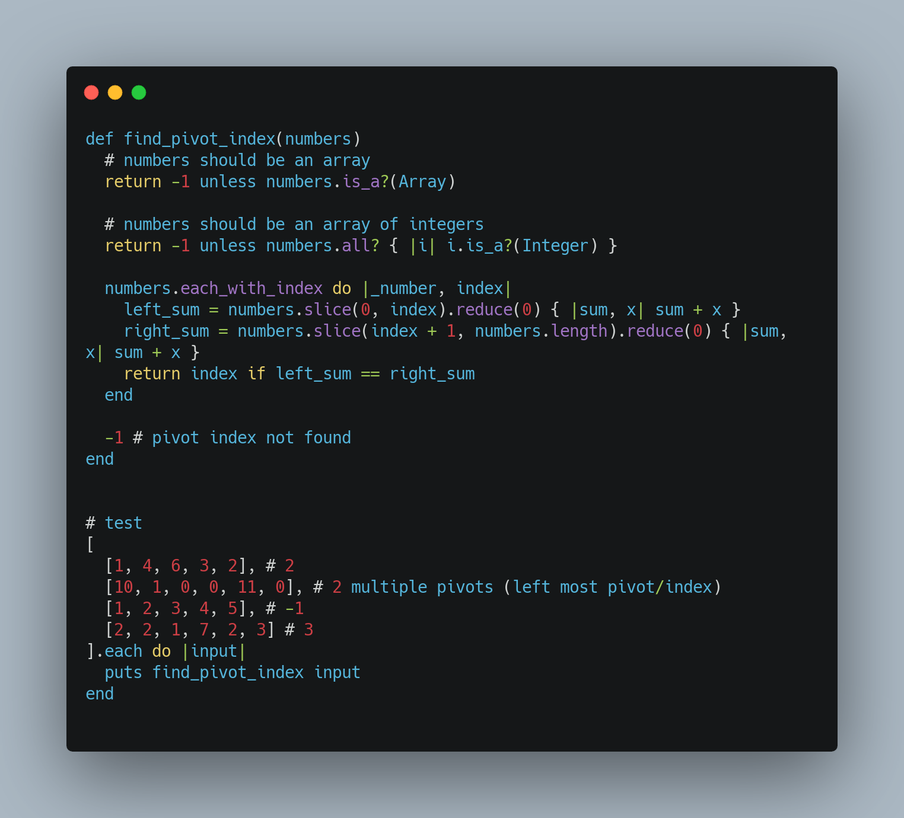

# Find Pivot Index



```ruby
def find_pivot_index(numbers)
  # numbers should be an array
  return -1 unless numbers.is_a?(Array)

  # numbers should be an array of integers
  return -1 unless numbers.all? { |i| i.is_a?(Integer) }

  numbers.each_with_index do |_number, index|
    left_sum = numbers.slice(0, index).reduce(0) { |sum, x| sum + x }
    right_sum = numbers.slice(index + 1, numbers.length).reduce(0) { |sum, x| sum + x }
    return index if left_sum == right_sum
  end

  -1 # pivot index not found
end

# test
[
  [1, 4, 6, 3, 2], # 2
  [10, 1, 0, 0, 11, 0], # 2 multiple pivots (left most pivot/index)
  [1, 2, 3, 4, 5], # -1
  [2, 2, 1, 7, 2, 3] # 3
].each do |input|
  puts find_pivot_index input
end
```
