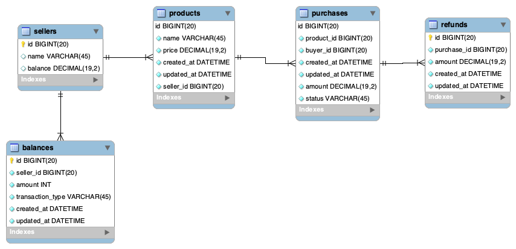

# Challenge 3

Here is the overview of our models

Aside from sellers, products, purchases, there are additional 2 tables: balances & refunds.

The requirements of the challenges are:

1. Sellers can refund purchases
2. Gumroad can have the flexibility to pay sellers with the terms.

Now, the sellers, products, and purchases tables are what we have expected for Gumroad's current system. I want to dive deeper into balances and refunds tables.

> Balances table will be responsible for tracking records of what's happening with the seller's balance.

#### If a purchase is refunded

- Insert new "refund" `transaction_type` with its amount to `balances` table.
- Subtract `balance` column in `sellers` table
- Insert new record to `refunds` table belong to the `purchase_id`

> This way, sellers can have their "balance account history".

Then, how about changing sellers payout schedule?

#### If a seller is paid out

- Insert new "payout" `transaction_type` with seller's current balance to `balances` table
- Subtract `balance` column in `sellers` table

As you can see in the picture earlier, there are `created_at` column which can be our guidance when is the last time sellers got paid.

> Whenever, we want to change payout schedule, simply refers to this `balances` table.

## Based on this assignments, we will have these indexes

- `balances.seller_id`
- `balances.transaction_type`
- `refunds.purchase_id`
